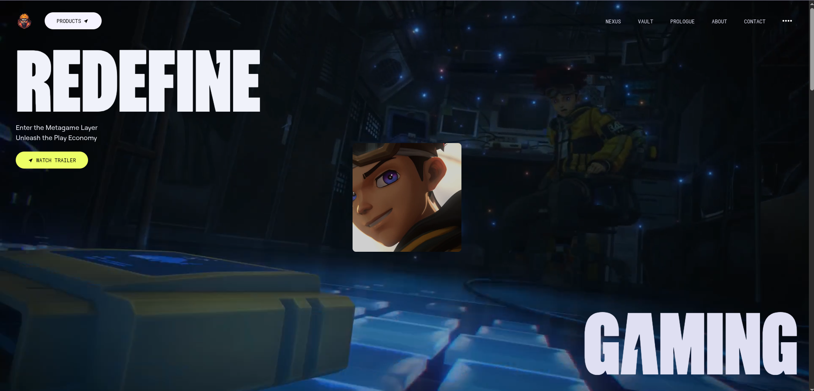
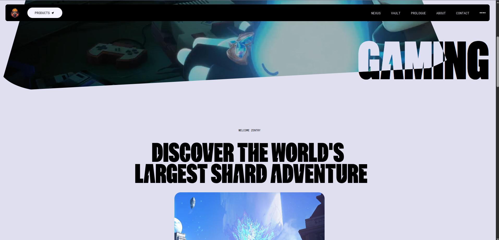
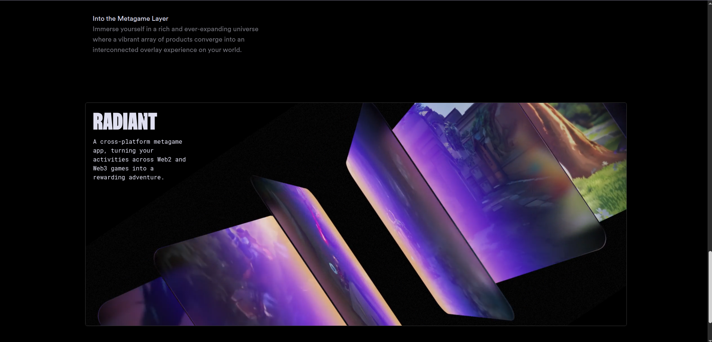

# Awwwards Clone – React & Tailwind CSS

A modern, interactive clone of an Awwwards winning website, [zentry.com](https://zentry.com/), built with **React.js**, styled with **Tailwind CSS**, animated with **GSAP**, and enhanced with **Font Awesome** icons. This project replicates the sleek design and smooth user experience of Awwwards, showcasing award-winning websites with a responsive, animated interface.

---

## 🚀 Features

- 🎨 Responsive design using **Tailwind CSS**
- 🖼️ Dynamic hero sections and animated elements
- 🔗 Interactive navigation with hover effects
- 🌐 Font Awesome icons for consistent, scalable UI elements
- ⚛️ Built with **React.js** for component-based architecture
- 📱 Fully mobile-responsive layout

---

## 🛠️ Technologies Used

- **React.js** – For building a dynamic, component-driven UI
- **Tailwind CSS** – For utility-first, responsive styling
- **GSAP** – For high-performance animations and scroll effects
- **Font Awesome** – For scalable vector icons
- **React Router** – For client-side routing
- **Vite** (or Create React App)